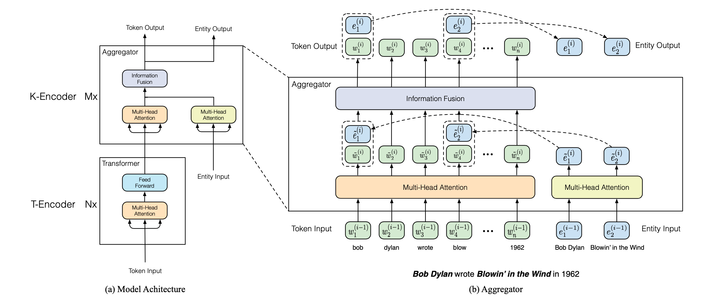
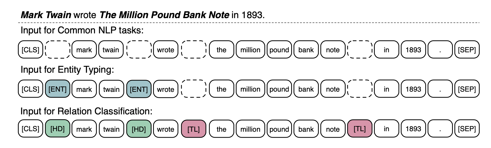

# ERNIE 介紹 與 情感分析應用

> 以往的language model如Bert，透過大量的文本訓練，來學習每個token的語意資訊，但如果可以在學習的過程中把人類的Knowledge一起考慮進去呢？

> [ERNIE](https://arxiv.org/pdf/1905.07129.pdf)的目的是在原本的BERT模型中，再加上Knowledge Graph(KG)的知識，以增強language model的效能

> 在閱讀前，可以先去了解BERT或是Attention Is All You Need ~

## Knowledge Grap

在開始之前，先來看一下Knowledge Graph(KG)是啥米東東～

**什麼是Knowledge Graph(KGs)**

Knowledge Graph 是一個有向圖，目的是可以將人類的知識有結構的儲存起來，圖中的點為Entity，邊則代表兩個Entity間的關係

KG中最簡單的表達知識的單位是一個triplet(head entity h, relation r, tail entity t)，用 relation r 來表示兩個 entity h, t間的關係，譬如 ( 田馥甄, 職業, 歌手 )

許多個triplet便可以組成Knowledge Graph :

 

**什麼是Knowledge Graph Embedding**

通常一個KG中會有很大量的entity與relation，因此如果我們用one-hot的方式，會發現每一個embedding的dimension都非常的大，因此Knowledge Graph Embedding的目的就是去學習一個low-dimension的vector，去表示KG中的每個entity與relation，而學習好的KG embedding因為含有很KG中的資訊，因此可以用在許多不同的task中，向本篇就是用在增強language model的效能上。

而我們要如何取得low-dimension的vector呢？其中一個個單而經典的方法是TransE，這也是ERNIR所使用的方法，TransE會將每個triplet中的relation視為一個轉換的方式，head經過relation的轉換後成為了tail，用公式來表達的話即是 $e_h + e_r = e_t$，而TransE的loss便是最小化$|e_h+e_r-e_t|$的值。

---------

## ERNIE

舉例來說，一個句子 *Bob Dylan wrote Blowin’ in the Wind in 1962* ，會需要先偵測出句子裡有哪一些entity（如 Bob Dylan 與 Blowin’ in the Wind），並將這些entity的KG embedding的資訊加進language model中，作者在paper裡面沒有詳細的敘述用什麼方法找到句子的entity，但在github裡面有說，是使用tagme這個套件去找到每個句子裡面對應的entity，且作者是使用wiki的資料作為訓練的，在github裡面有提供英文訓練的資料集。

**作者提出本篇論文的兩個 Challenge** :

 (1) Structured Knowledge Encoding : 如何將一段文字中對應的entity找出來

 (2) Heterogeneous Information Fusion : Bert 的 embedding space 與 TransE 的 embedding space 是不同的，要如何設計一個模型去統合兩個不同的資訊

----------------

## Model Architecture

先來看模型的整體架構圖，基本上分成了兩個部分T-Encoder與K-Encoder，其中T-Encoder與是原本的Transformer負責學習語意的訊息，而K-Encoder的部分則加入了KG的資訊，並整合Bert與TransE兩種information。

------------

## T-Encoder：

負責去學習token(文字)本身的資訊，在這一部份作者採用Bert的參數來初始化模型的參數，T-Encoder會重複接N次

Input token {w1,...,wn}，為一個句子中的第1到n個字，跟BERT的中的input是一樣的，每個token的token embedding會將三種資訊加起來：token embedding - 標示每個字與一些特殊符號)、segment embedding - 標示不同的句子，positional embedding - 用sin跟cos函數來標示句子中字的順序。

-------------------

## K-Encoder：

負責整合token information與knowledge information，在T-Encoder後會在接M層K-Encoder，並且會多輸入KG中entity的embedding，K-Encoder的輸入是經過T-Encoder轉換完後的feature，注意公式左邊的粗體**{w1,...,wn}** 是T-Encoder的output，與Input token {w1,...,wn}是不一樣的。

$$
**{w_1,...,w_n}** = T-Encoder({w_1,...,w_n})
$$

而K-Encoder除了token以外還會多了KG embedding作為輸入：

$$
\{w_1^o,...w_n^o\},\{e_1^o,...e_n\} = K-Encoder(\{w_1,...,w_n\}\{e_1,...,e_n\})
$$
圖中公式的**{e1,...,em}**為KG embedding，使用TransE作為petrain，**{w1,...,wn}**為T-Encoder的output

有上標小o的代表為整個模型的output

---------

## Aggregator in K-Encoder

可以看模型架構圖中(b) Aggregator的部分，用兩個不同的 MultiHead Attention 來對**{e1,...,em}**與**{w1,...,wn}**做計算，這裡的 MultiHead Attention 跟 Transformer 是一樣的。下面的公式表示將 i-1 前一層(的token embedding $w_i^{(i-1)}$與entity embedding $e_j^{(i-1)}$，放進兩個不同的MultiHead Attention，可以拿到當前 i 層的token embedding $\widetilde{w}_i^{(i-1)}$ 與entity embedding$\widetilde{e}_j^{(i-1)}$
$$
\{\widetilde{w}_1^{(i)}, ... ,\widetilde{w}_n^{(i)}\} = MH-ATT(\{\widetilde{w}_1^{(i-1)}, ... ,\widetilde{w}_n^{(i-1)}\})
\\
\{\widetilde{e}_1^{(i)}, ... ,\widetilde{e}_m^{(i)}\} = MH-ATT(\{\widetilde{e}_1^{(i-1)}, ... ,\widetilde{e}_m^{(i-1)}\})
$$

由於ERNIE比BERT還多出來了entity的資訊，因此作者改良了原本Transformer中feed-forward的部分，以將兩個不同的資訊整合起來，於是作者提出了Information Fusion Layer，我們先看一下原本Transformer的feed-forward的公式：
$$
FFN(x) = max(0, xW1 + b1 )W2 + b2
$$
公式的輸入x為前面MultiHead Attention的輸出，由於每層MultiHead Attention會有$h$個，而 Attention Is All You Need 中有提到建議的參數設置 $d_k = d_v = d_{model}/h = 64$，$d_k$是MultiHead Attention時在做Q, K, V轉換時的維度，因此$x \in R^{d_{model}}$，$d_{model}$ 為為模型的輸入以及輸出的embedding size。而公式是對x做兩層的線性轉換，且第一層轉換的activate function為RELU，其中 $W1\in R^{d_{model} \times 4d_{{model}} }$、$W2\in R^{4d_{model} \times d_{{model}} }$

而在ERNIE的Information Fusion Layer中，只會有部分的字有對應到KG中的entity(像架構圖中只有w1與w4有對應到entity)，因此會對有對應到entity的token與與沒有對應到的token進行下列不同的轉換：
$$
有對應到entity的token:\\
h_j = \sigma(\widetilde{W_t}^{(i)}\widetilde{w_j}^{(i)}+\widetilde{W_e}^{(i)}\widetilde{e_k}^{(i)}+\widetilde{b}^{(i)})\\
w_j^{(i)} = \sigma(W_t^{(i)}h_j+b^{(i)}_t)\\
e_k^{(i)} = \sigma(W_e^{(i)}h_j+b^{(i)}_e)\\ 
沒有對應到的：\\
h_j = \sigma(\widetilde{W_t}^{(i)}\widetilde{w_j}^{(i)}+\widetilde{b}^{(i)})\\
w_j^{(i)} = \sigma(W_t^{(i)}h_j+b^{(i)}_t)
$$

可以看到 $ h_j $是融合了token與knowledge兩種不同資訊的hidden vector，可以對應到原本的Feed-Forward中的第一層線性轉換，第二層線性轉換的部分則需要對token與entity做不同的線性轉換的計算，以獲得 $w_j^{(i)}$ 與 $e_k^{(i)}$ 作為下層的K-Encoder中的輸入。而對於沒有對應到entity的token，則只使用$\widetilde{w_j}^{(i)}$去計算 $ h_j $，也只需要計算$w_j^{(i)}$就可以了。作者在這部分沒有詳細說明轉換矩陣的維度，因此沿用 Attention Is All You Need 中的話，所有有～的Ｗ維度為 $ R^{d_{model} \times 4d_{{model}}} $ 沒有～的Ｗ為 $R^{4d_{model} \times d_{{model}} }$

-------

## Pretrain Task - Denoising Entity Auto-Encoder

在Pretrain task的部分，為了讓模型可以多學習到KG中的知識，因此ERNIE除了原本BERT的兩個pretrain  task之外，多增加了一個新的task : denoising entity auto-encoder (dEA)，而ERNIE跟Bert一樣為了訓練模型，ERNIE會隨機mask掉一些配對好的token與entity的pair:

(1)有5%的機率會把一個配對好的(token,entity)的pair中的entity隨機換成其他entity

(2)有15%的機率會mask掉原本配對好的token,entity之間的關係，這個步驟是為了讓模型有能力可以改進entity alignment model如果沒有找到全部的entity的時候，模型可以有能力訂正錯誤

整個eDA的目地為最大化輸了句子中的token(只有計算有配對到entity的token)配對到正確的entity的機率，公式如下:
$$
f(e_j|w_i)=\frac{ exp(linear( w^o_i ) · e_j )}{\sum_{k=1}^{m}exp(linear(w^o_i) · e_k)}
$$
$w_i^o$ 是K-Encoder玩的結果，而 $e_j$ 代表 entity j 的 kg embedding (還沒經過ERNIE)。此外，作者有特別提到，因為全部KG中的entity很多，因此在做dEA時只會預測原本就與輸入句子有配對到的entity，譬如在架構圖中的例子就只會去計算兩個entity：Bob Dylan 與 Blowin’ in the Wind

eDa loss function : 而eDA的loss function為cross-entropy function，作者沒有列出來，這裡我自己帶入公式：
$$
-\sum_{s \in S} \sum_{k=1}^{m} f(e_j|w_i)log(f(e_j|w_i))
$$
對每一個輸入的句子中所有有對應到的entity，都希望模型可以正確地預測出配對到的token

-------

## Fine-tuning Task

最後，ERNIE跟BERT一樣可以在fine-tuning後使用在不同的task上，作者特別提到兩個特別的task : entity typing 與 relation typing

* entity typing - 給一個句子與句子中對應到的entity，預測該enriry的類別

* Relation classification - 知道一個句子中提及的兩個entity(分別為triplet中的head embedding與tail embedding)，預測這兩個entity間的relation

這兩個task與bert一樣，會將標示句子開頭的[CLS]的embedding拿來進行後面的分類任務，而且作者為這兩個task設計了不一樣的input token的方法，作者使用了特殊的tag來標示句子中出現的entity，可以發現下面的範例句子中作者用tag [ENT] 來標示 head entity，以及[TL] 來標示tail entity

而在實驗的部分，可以看到在做跟KG有關的task時，ERNIE表現亮眼，不過在其他task上的表現似乎就與BERT差不多，有興趣的可以去原paper看實驗數據。

---

## Demo ...

作者有提供[開源的程式碼](https://github.com/PaddlePaddle/ERNIE)，以及預訓練好的模型給大家下載，也有提供demo code，我將其中一個Sentiment Analysis 的 demo code修改一下，主要加了註解以及套件還有資料集的下載安裝，可以直接在colab蹭飯，有興趣的可以跑看看～

